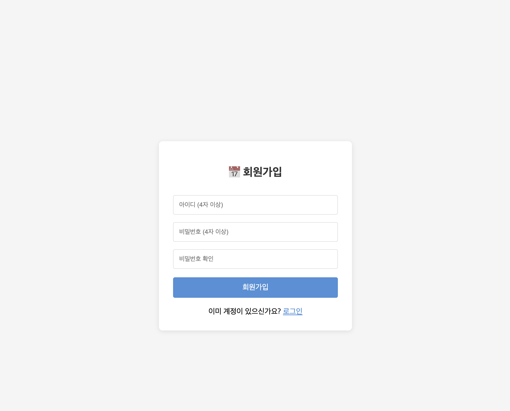
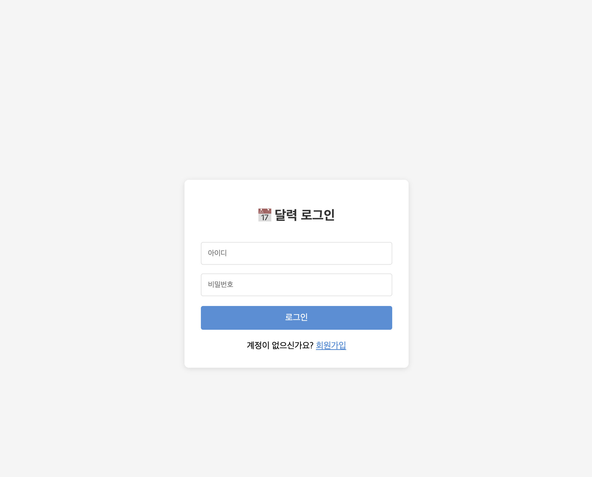
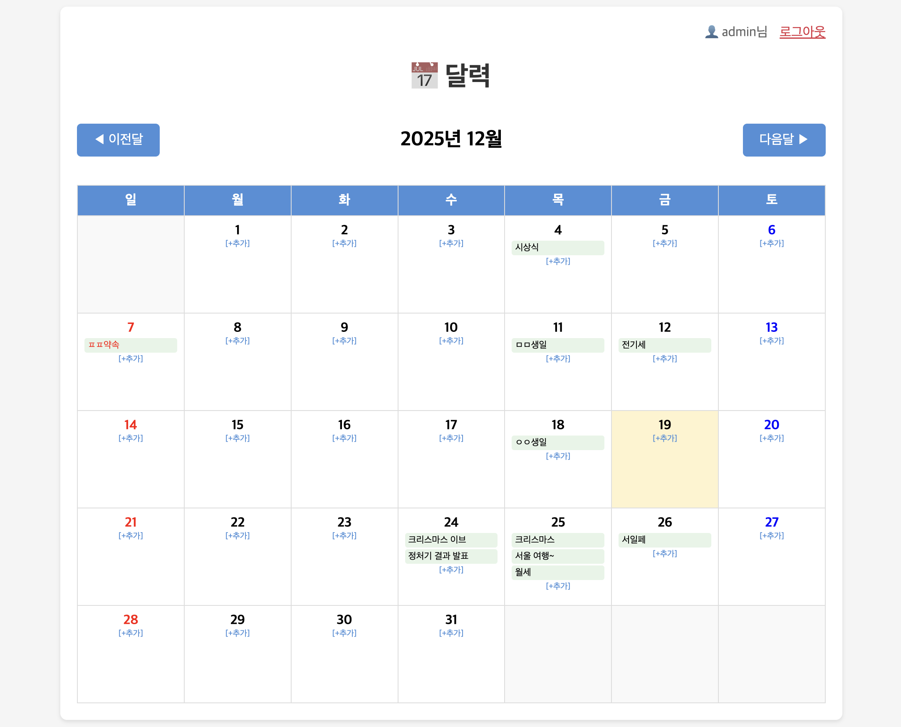
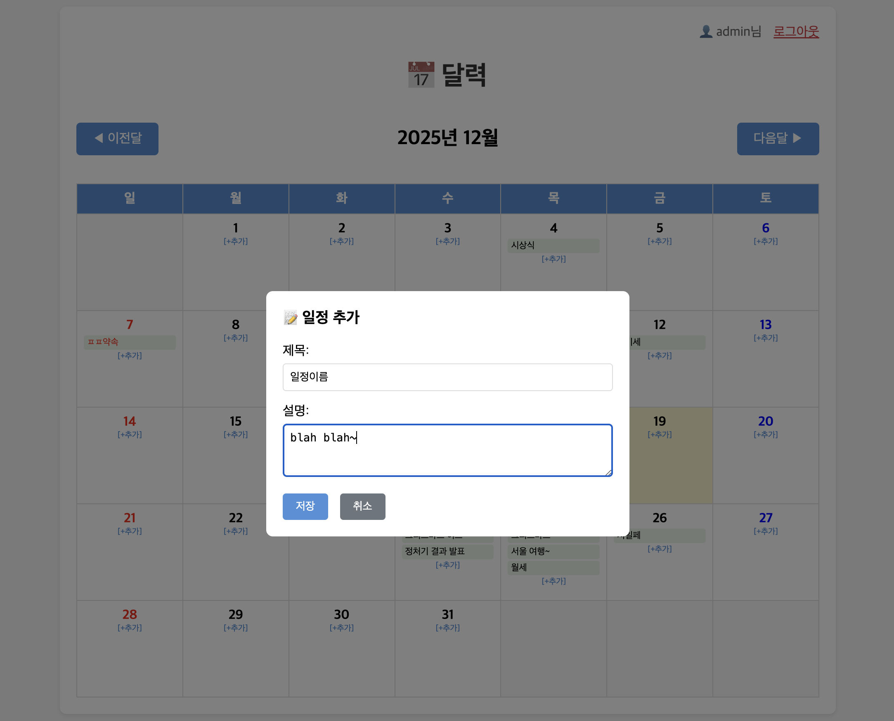
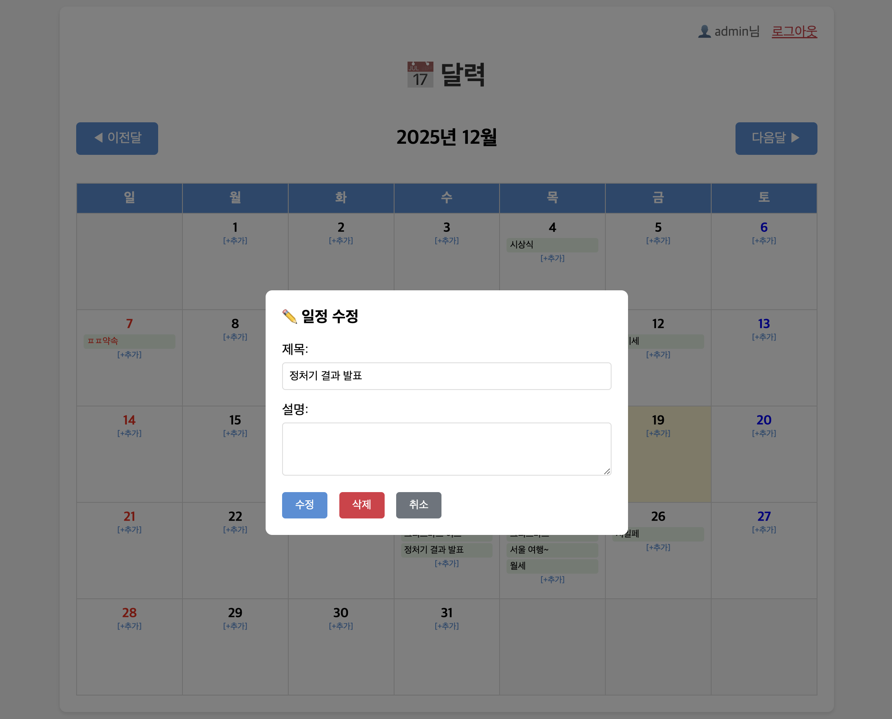

# PHP 달력 (CRUD)

PHP와 MySQL을 사용한 일정 관리 달력 웹 애플리케이션

## 페이지 설명

### 회원가입 (register.php)

아이디와 비밀번호를 입력하여 새 계정을 생성한다.

### 로그인 (login.php)

등록된 계정으로 로그인하여 달력에 접근한다.

### 달력 (calendar.php)

월별 달력을 표시하고 일정을 추가/수정/삭제할 수 있다.

### 일정 추가

날짜를 클릭하여 새로운 일정을 등록한다.

### 일정 수정/삭제

등록된 일정을 클릭하여 내용을 수정하거나 삭제한다.

